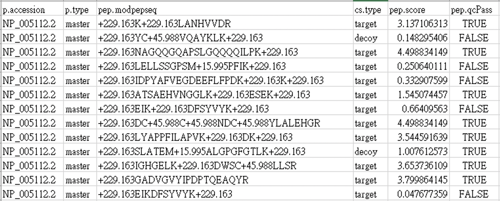
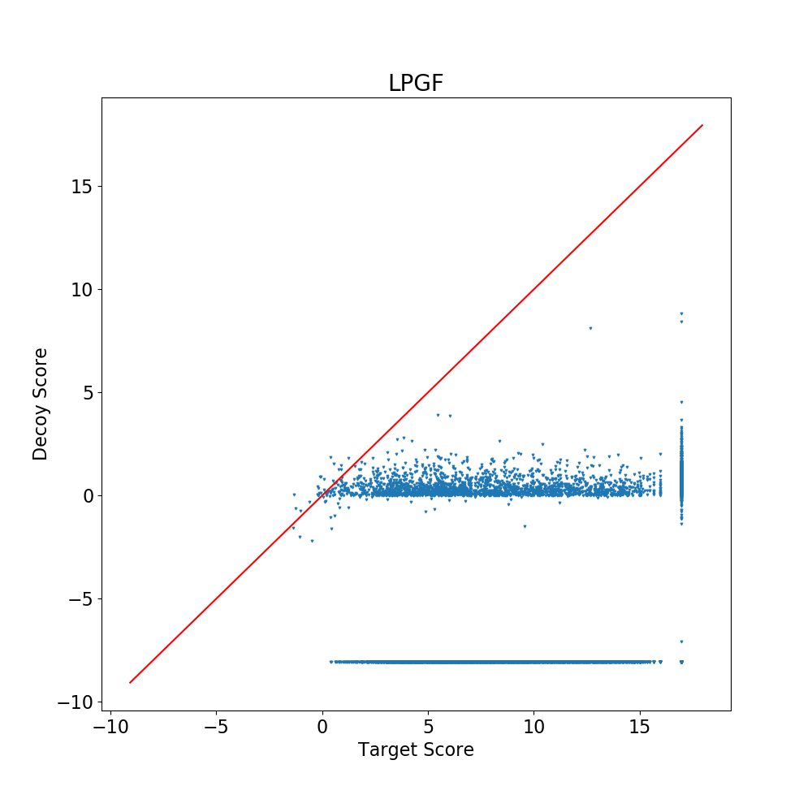

# FDRr (a new FDR in shotgun proteomics)

In shotgun proteomics, the validity of proteomic identifications is checked by false discovery rate (FDR). We calculated new estimation method of FDR called FDRr (or LPGF) by following the regulation on [Protein Probability Model for High-Throughput Protein Identification by Mass Spectrometry-Based Proteomics](https://pubs.acs.org/doi/10.1021/acs.jproteome.9b00819).

Because tones of peptides ready to be sorted by p-value, we used SQLite to set up our database when p and q-value  were calculated. There are some advantages to save data as SQL database. First, it is extendable when we want to append other peptide data to database. Second, it is time-saving to select and rank our peptides by p-value.

After a series of calculation, we can truly find target peptides instead of decoy peptides by comparing the decoy score and target score.

## Demo

1. peptide data

2. FDRr(LPGF)

Peptides at right area represent that we have higher confidence in regarding it as target peptide, and vice versa.

